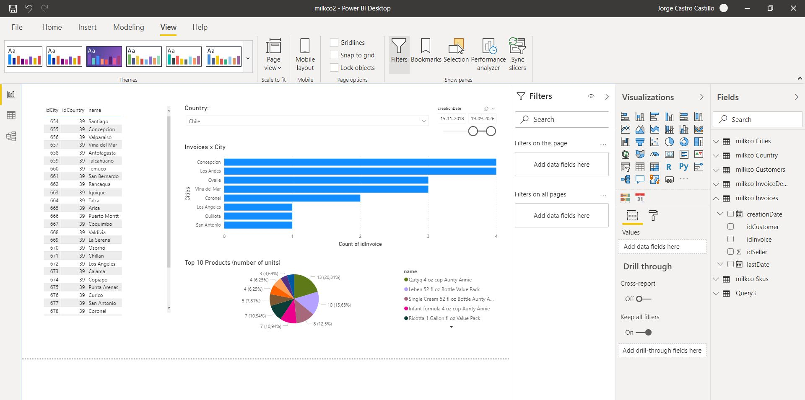
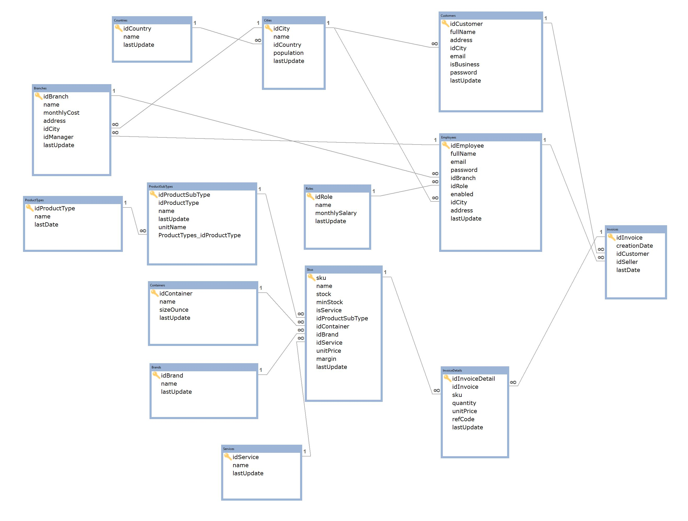
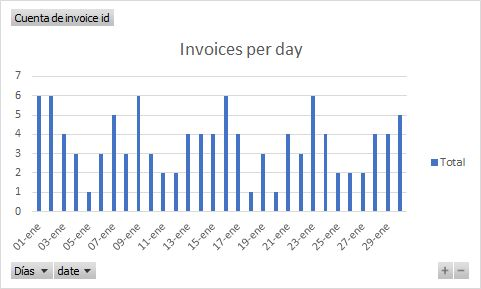
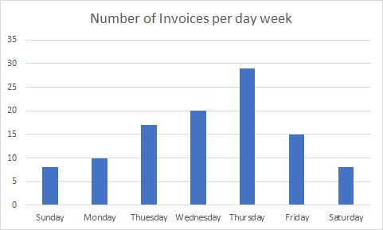

# MilkCo-Database
It is an example database for MYSQL/Sql Server and it works similar to Sakila, AdventureWorld and other example 
databases.


> Photo from unsplash.com/@jaypix_01

It is a database model of a Milk Company that we could use to test and evaluate Business Intelligence and Data Science.

## Visual Example using Microsoft Power BI



[powerbi/milkco_example_v2.pbix](powerbi/milkco_example_v2.pbix)


> Note: It points to my database so you will want to change the datasource.    
> Note: Shocking but it worked OOBE Out Of Box Experience 📦 It is thanks to PowerBI understands foreign keys.   

### Requirements

* Microsoft PowerBI (desktop is for free https://powerbi.microsoft.com/en-us/downloads/ )   
* MySql Connector Net ( https://dev.mysql.com/downloads/connector/net/ ) If you are using Mysql Database
* If you are using Sql Server, then you don't need any aditional.

## ER Diagram



## Features

* Products (Skus) divided in types, subtypes, container (cup, bottle, etc.) and brands.
* 3 Brands: Value Pack, Auntie Annie and Red Label (cheap, normal and expensive)
* More than 10 years of sales.
* A worldwide company with offices, employees and customers across the globe.
* The products has a trends (some products are more sold than others)
* The sales has seasonal trends in the number of invoice and in the size of the invoices.
* 50 Branches (offices) across the globe.
* 1000 Employees
* 17000 Invoices starting the 2005. The invoices have stationary trends.
* 64000 Invoice details. The invoices have stationary trends.
* 3563 Customers. Some of them are companies
* The database model is vanilla and clean. It does not have views, store procedure, functions or even index (with the exception of primary key and foreign keys)
* The columns are normalized to use the minimum type of definitions.

| types              | Mysql Definition |
| ------------------ | ---------------- |
| Integer numbers    | int              |
| Strings and texts  | varchar          |
| Money and decimals | decimal(10,2)    |
| Booleans           | tinyint          |
| Date               | DateTime         |
| Timestamps         | Timestamp        |

## Specifications

* Every Indexes have a prefix called "id" with the exception of "Sku", where "sku" is the index without a prefix.
* Foreign keys don't have a special name. Usually they have the same name than the primary key.
* All tables are in plural. Composed names are written in camel case.
* Columns are written in lowercase, and it starts in lowercase.

## Considerations

* It works with MySQL 8.0 or higher** or Sql Server 2019 or higher.
* It could work with an older version of MySQL, but you must replace the encoding:

```sql
-- mysql 8.0
DEFAULT CHARSET=utf8mb4 COLLATE=utf8mb4_0900_ai_ci
-- mysql <=5.7
DEFAULT CHARSET=utf8 
```

* It could with with an older version of Sql Server (using the script) but it is not tested.

* It misses some features. For example, a table of purchases, the salaries and the costs of each branches are fixed
* Values are not inflationary. 
* It lacks shipping
* It does not consider taxes. If the taxes are flat, then it is not a problem.

## Trends

This database was created with random values. However, it has some trends 

>   (I don't want to spoil much the results 😀)

### For example, the invoices per day (January 2020)



So, apparently, there is not a trend.

### And Invoices per day week (January 2020)



Did you see the trend?


## How to install it? 

### Mysql

1. Create a new schema or use one.

```sql
CREATE SCHEMA `milkco` ; -- or you can use any name.
```

2. Run the [v2/ddl.sql](v2/ddql.sql)  script
   
   1. It includes the structure of the database and the foreign key.s
3. Run the [v2/dml.sql](v2/dml.sql) script.
   
   1. It includes the data of the database.
4. (optional) You can delete all data executing the next script [v2/truncate_all.sql](v2/truncate_all.sql)   
5. (optional) You can delete most data (data that usually changes) by executing the next script [v2/truncate_nofixed.sql](v2/truncate_nofixed.sql)

### Sql Server

#### Using the backup

> This is the method recommended, but it is only compatible with Sql Server 2019/2019 or higher (Express, Standard or DataCenter).

Load next backup file [sqlsrv/milkco2019.bak](sqlsrv/milkco2019.bak)
Load next backup file [sqlsrv/milkco2012.bak](sqlsrv/milkco2012.bak)    

#### Using a Script

Load next script file [sqlsrv/sql.zip](sqlsrv/sql.zip)    

   
## Related link

https://www.southprojects.com/architecture/milko-fake-database-example

## Versions

* 2.2.1
    * Fixed sql server 2012 (.bak) because it misses some foreign keys.  
* 2.2 
    * Added sql server 2012 and 2019.
* 2.1
    * Added Sql Server.       
* 2.0
    * Rebuild the information. Now it has more records, but it is only for (more or less) 15 years.
    * Tables related with **cities** are not related with **countries** anymore (it was redundant)
    * **Customers** buy from **branches** (offices) in the same **country**.
    * **Employees** works in the same city as **branches**.
    * **Customers** generate at least 1 invoice.
    * **Branches** trend to reside in populous cities. Usually, dairy companies reside in rural towns but they sold it 
    in big cities.
    * **Customers** could generate 1 **invoice** per day or longer.
* 1.1 
   * Table **Country** renamed as **Countries**.
   * New script truncate_all.sql   
   * New script truncate_nofixed.sql     
* 1.0 
   *   First version    
   


